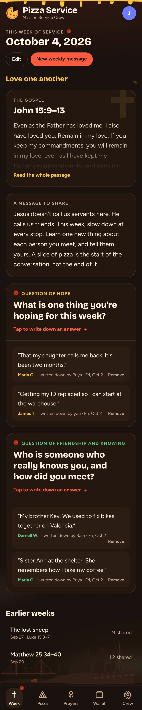

# Pizza Service 🍕

Costco pizza for our community service crew. Whoever picks up the pizzas logs what they paid, everyone gets an email, and after the number of days an admin picks, the pizza is "sliced": the card of everyone chipping in is charged and the money goes straight to the payer's bank.

The app name and the thank-you line, "Thank You, God Bless your Service" (shown when someone logs a pizza, chips in, subscribes, or pays, and in the emails), live in `src/lib/brand.ts`. The look: a dark brick-oven palette, cheese drips and drifting pepperoni, and a quiet San Francisco skyline at the bottom of every screen (Golden Gate, Transamerica, Salesforce Tower, Coit, Sutro Tower, the Painted Ladies, and a cable car climbing its hill) with Karl the Fog rolling through.



- **Next.js 16** (App Router) installable as a **PWA**
- **Supabase**: Postgres, Google sign-in, realtime (the pizza re-slices live as people join)
- **Stripe**: saved cards for off-session charges, **Connect Express** to pay the buyer out to their bank
- **Resend**: emails for new spend requests, slicing receipts, and failed charges

## The weekly message, neighbors, and prayers

- **Week tab (home):** admins post the week's gospel, a message to share, a *question of hope*, and a *question of friendship and knowing*. Publishing, or saving an update with "Email everyone" checked, emails every member through Resend.
- **Answers:** anyone on the crew taps a question, types the neighbor's name (live, typo-tolerant search finds people we've met before so answers stay connected to the same person), and writes down what they shared.
- **Neighbors:** each person has a page with everything they've shared and every prayer request for them, across weeks. Names are usually a first name and last initial.
- **Prayers tab:** add a request for someone by name or anonymously (anonymous requests don't show who added them).
- **Weekly email:** the new message, plus last week's answers and the prayer requests added since the last message.
- Admins are whoever has the admin role on the Crew tab. The first account to sign in is the admin.

Run `supabase/migrations/0002_weekly.sql` after `0001_init.sql`.

## How it works

| Who | What they do |
| --- | --- |
| **Payer** (whoever picked up the pizza) | Connects a bank once through Stripe. Taps **Log pizza**, enters the amount. |
| **Subscriber** | Saves a card and turns on **Subscribe**. They're added to every new split automatically and can skip any week. |
| **One-timer** | Saves a card and taps **I'm chipping in** on a single split. |
| **Admin** | Sets days before slicing, the charge time and time zone, who covers card fees, invites, and roles. Can **Slice now**. |

At slice time the amount is split evenly across everyone chipping in, including the payer if they count their own slice. The payer's own share is never charged; they absorb any leftover cent. Each other eater gets one off-session card charge, a Stripe *destination charge* that transfers their share to the payer's connected account. Failed charges (declines, 3-D Secure) email the person a **Pay my share** link.

Card fees: by default eaters cover them (each charge is grossed up for 2.9% + 30¢, so the payer gets back exactly what they spent). Admins can switch to "payer covers", which takes the fee out of the payout instead. The platform account never fronts fees, except the small extra Stripe charges on international cards.

## Setup

### 1. Supabase
1. Create a project. In **SQL Editor**, run `supabase/migrations/0001_init.sql` then `0002_weekly.sql` (or `npx supabase db push` after `npx supabase link`).
2. **Authentication → Providers → Google**: enable it with a Google OAuth client. In Google Cloud, set the authorized redirect URI to `https://<project>.supabase.co/auth/v1/callback`.
3. **Authentication → URL Configuration**: Site URL = your app URL. Add `http://localhost:3000/auth/callback` and `https://<your-app>/auth/callback` to the redirect URLs.
4. Copy the URL, publishable key and secret key into env vars.

The first person to sign in becomes admin. Everyone else joins through the invite link on the **Crew** tab.

### 2. Stripe
Use a **US** Stripe account (connected accounts and payouts are US/USD).
1. Turn on **Connect**, then open Settings → Connect → **Platform profile** and accept responsibility for losses (negative balances and disputes). The pizza split uses destination charges, which need the platform as the losses collector; Stripe refuses to create payout accounts until this is done.
2. API keys → `NEXT_PUBLIC_STRIPE_PUBLISHABLE_KEY` and `STRIPE_SECRET_KEY`.
3. Whoever picks up pizza gets an **Accounts v2** recipient account with the Express Dashboard (hosted onboarding, bank payouts).
4. Webhooks, both pointing at `https://<your-app>/api/stripe/webhook`:
   - **Webhook endpoint** (snapshot events): `payment_intent.succeeded`, `payment_intent.payment_failed` → `STRIPE_WEBHOOK_SECRET`
   - **Event destination** (thin events, Accounts v2): `v2.core.account[configuration.recipient].capability_status_updated` → `STRIPE_V2_WEBHOOK_SECRET`
   - Local: `stripe listen --forward-to localhost:3000/api/stripe/webhook`

### 3. Resend
1. Create an API key at resend.com and put it in `.env.local` (and in Vercel) as `RESEND_API_KEY`.
2. Check it works: `npm run email:test -- you@example.com`.
3. While `EMAIL_FROM` is empty, mail comes from Resend's `onboarding@resend.dev`, which only delivers to your own Resend account address. To email the whole crew, verify a domain in Resend (Domains → Add, then add its DNS records) and set `EMAIL_FROM="Pizza Service <pizza@yourdomain.com>"`.

Without a key, emails are logged to the server console instead.

### 4. Vercel
Import the GitHub repo, add every variable from `.env.example` (set `NEXT_PUBLIC_SITE_URL` to the production URL), and deploy.

### 5. Scheduler (the thing that slices pizzas)
`/api/cron/slice` slices every split whose time has passed. It needs `Authorization: Bearer $CRON_SECRET`. Pick one way to call it:
- **Supabase pg_cron** (works on free plans): edit the URL and secret in `supabase/cron.sql`, then run it in the SQL editor. It calls the endpoint every 5 minutes.
- **Vercel Cron** (Pro plan, since Hobby only allows daily jobs): add `{"crons":[{"path":"/api/cron/slice","schedule":"*/5 * * * *"}]}` to `vercel.json`.

## Develop

```bash
cp .env.example .env.local   # fill in keys
npm install
npm run dev
```

`node scripts/gen-icons.mjs` regenerates the PWA icons.

## Map

- `src/lib/slicer.ts`: charges everyone for a split, idempotently (claims the split, one Stripe idempotency key per person)
- `src/lib/split.ts`: share math and fee gross-up
- `src/lib/time.ts`: "N days later at HH:MM in the crew's time zone", DST-safe
- `src/app/actions.ts`: server actions (log a pizza, join, leave, subscribe, admin settings)
- `src/components/Pizza.tsx`: the animated pizza that gets cut into more slices as people join
- `src/components/Backdrop.tsx`, `src/components/Toppings.tsx`: the SF skyline, fog, cheese drips and pepperoni
- `/dev/preview/<screen>`: every screen with sample data (dev only), used for `docs/screenshots`
- `supabase/migrations/0001_init.sql`: schema and RLS (browsers can only read, and only members; all writes are server-side)
